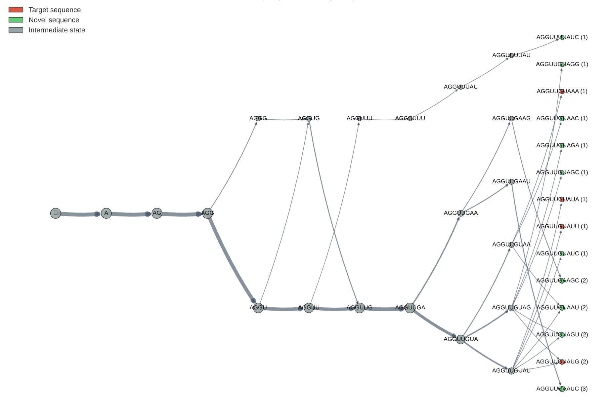

# GFlowNet for Sequence Design 

Code for [AncestorGFN: Evolutionary Sequence Design with GFlowNets](https://www.biorxiv.org/content/10.64898/2026.04.08.717239v1.full.pdf) (ICLR 2026 Workshop on Generative Models for Genomics).

We train GFlowNets to generate RNA sequences proportional to reward, targeting LET-7 miRNA family members across species. The codebase supports TB, DB, and FL-DB objectives with GPU-accelerated batch training.

<p align="center">
  <br/>
  <em>Learned GFlowNet flow network over RNA sequence trajectories, with target, novel, and intermediate states.</em>
</p>

## Setup

```bash
pip install -r requirements.txt
```

## Quick Start

```python
from gfn import train, TrainingConfig
from gfn.reward import TargetMatchReward

targets = [['A', 'U', 'G', 'C'], ['C', 'C', 'U', 'A'], ['G', 'G', 'G', 'G']]
result = train(TargetMatchReward(targets, r_min=0.1), TrainingConfig(n_episodes=20_000))
```

For the full LET-7 22bp training run:
```bash
python train_LET7_22bp.py
```

## Notebooks

- `run_training.ipynb` — toy example (4bp), compares TB vs DB vs FL-DB
- `run_training_gpu.ipynb` — GPU training on 10bp targets
- `run_training_gpu_long_LET7.ipynb` — LET-7 22bp, the main experiment
- `run_training_gpu_long_LET7_10bp.ipynb` — LET-7 10bp substring variant
- `run_analysis.ipynb` — hit trajectories, phylogenetic coverage
- `run_analysis_sequence_design.ipynb` — greedy/stochastic/beam search generation

## Repo Structure

```
gfn/
├── env.py            # state space and transitions
├── model.py          # TB and DB networks
├── losses.py         # loss functions
├── reward.py         # reward schemes (Hamming, entropy-weighted, conservation)
├── training.py       # episode-based training loop
├── training_fast.py  # GPU batch training
├── visualization.py  # plotting
└── utils.py          # helpers

data/
├── LET7_22bp_targets.json   # 22bp targets filtered from miRBase
├── LET7_10bp_targets.json   # 10bp substrings (positions 10–19)
└── LET7_family_mature_ALLspecies.fa

phylogeny/
├── phylogeny_analysis.ipynb
└── phylogeny_pipeline.sh
```


