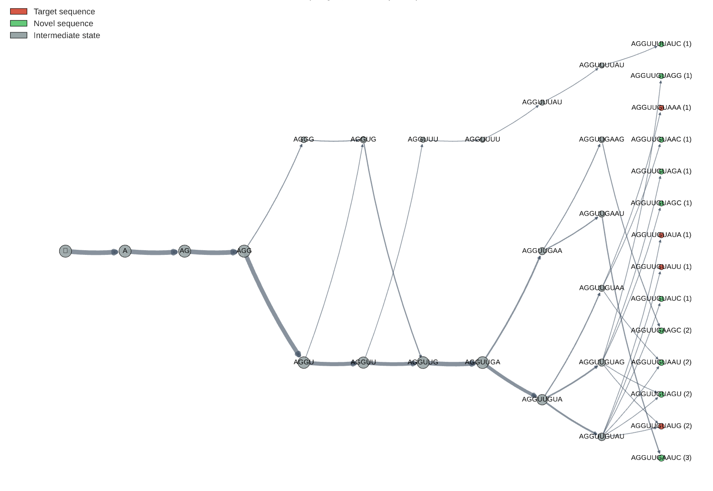

# AncestorGFN

**Evolutionary Sequence Design with GFlowNets**

[Read the paper](https://www.biorxiv.org/content/10.64898/2026.04.08.717239v1.full.pdf) · ICLR 2026 Workshop on Generative Models for Genomics

AncestorGFN explores RNA sequence generation with GFlowNets, using the LET-7 family as a case study. The examples cover sequence construction, reward-guided sampling and inspection of generated trajectories.

<p align="center">
  <br/>
  <em>A toy RNA sequence construction flow network.</em>
</p>

## Explore the project

| Resource | What it contains | Runs with this public checkout? |
| --- | --- | --- |
| [Results notebook](view_results.ipynb) | Recorded toy results and a comparison plot | Yes |
| [CPU training notebook](run_training.ipynb) | 4bp configuration, training calls and visualization | Requires private `gfn` |
| [GPU training notebook](run_training_gpu.ipynb) | Batch training API examples | Requires private `gfn` and CUDA |
| [Longer training notebooks](run_training_gpu_long_LET7.ipynb) | LET-7 22bp and 10bp experiment examples | Requires private `gfn` and CUDA |
| [Analysis notebooks](run_analysis.ipynb) | Saved trajectory analysis and [sequence design](run_analysis_sequence_design.ipynb) | Requires private `gfn` and run artifacts |
| [Example data](data/) | Synthetic targets and original LET-7 sequence inputs | Data only |
| [Usage notes](docs/USAGE.md) | Environment, execution and interpretation | — |

The core `gfn/` implementation is maintained privately. This repository publishes examples, data and results; it does not include a standalone training implementation.

## Quick start

Use uv to open the results notebook:

```bash
uv sync --locked --group notebook
uv run --locked --group notebook jupyter lab view_results.ipynb
```

Python 3.12 and a committed `uv.lock` provide the example environment. For training requirements, see [Usage](docs/USAGE.md).

## Verified toy results

The first CPU notebook completed four runs of 20,000 episodes on September 12, 2026. The three illustrated objective/reward combinations produced:

| Run | Exact target hits during training |
| --- | ---: |
| TB | 7.37% |
| DB | 5.99% |
| FL-DB | 9.43% |

TB/DB and FL-DB use different reward functions. These toy results are not a controlled comparison of objectives or biological validation. [Recorded metrics](examples/toy_results.json).

## Repository layout

```text
assets/                    Flow network figure
data/                      Example sequence inputs
docs/                      Usage and interpretation
examples/                  Recorded toy metrics
scripts/run_notebook.py    Notebook execution helper
view_results.ipynb         Public results viewer
run_training.ipynb         CPU API example
run_training_gpu*.ipynb    GPU and LET-7 examples
run_analysis*.ipynb        Saved-run analysis examples
pyproject.toml + uv.lock   Reproducible environment
```
